### free mes open source mes Manufacturing Execution System
### 免费MES、开源MES，市面上最好的免费MES
### 技术架构：Springboot2+ VUE3 + Mysql8 + Redis + Minio，也有SpringCloud版本
### 建议安装在Ubuntu Server 22.04服务器上面
### 下载 https://releases.ubuntu.com/22.04.2/ubuntu-22.04.2-live-server-amd64.iso

### 执行步骤：
### 1、安装docker
curl -fsSL https://download.docker.com/linux/ubuntu/gpg | sudo apt-key add -  
apt-get install -y software-properties-common  
add-apt-repository    "deb [arch=amd64] https://download.docker.com/linux/ubuntu $(lsb_release -cs) stable"  
apt-get install docker-ce  -y
### 2、安装docker-compose
sudo curl -L https://github.com/docker/compose/releases/download/v2.20.2/docker-compose-`uname -s`-`uname -m` -o /usr/local/bin/docker-compose  
sudo chmod +x /usr/local/bin/docker-compose
### 3、下载源码后，执行 docker-compose up
### 4、访问：http://localhost:48081  
用户名：admin  
密码：admin123

## 完整代码包含前端、后端、数据大屏、报表系统

## DEMO：
## 演示账号：
 https://mesv2.cloudmes.io/ 
### 账号：demo1   密码：111111   
### 账号：demo2   密码：111111

## 联系我们：17898898894
## MES系统流程图
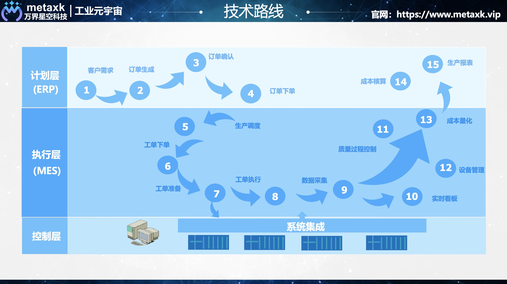

## MES功能架构图
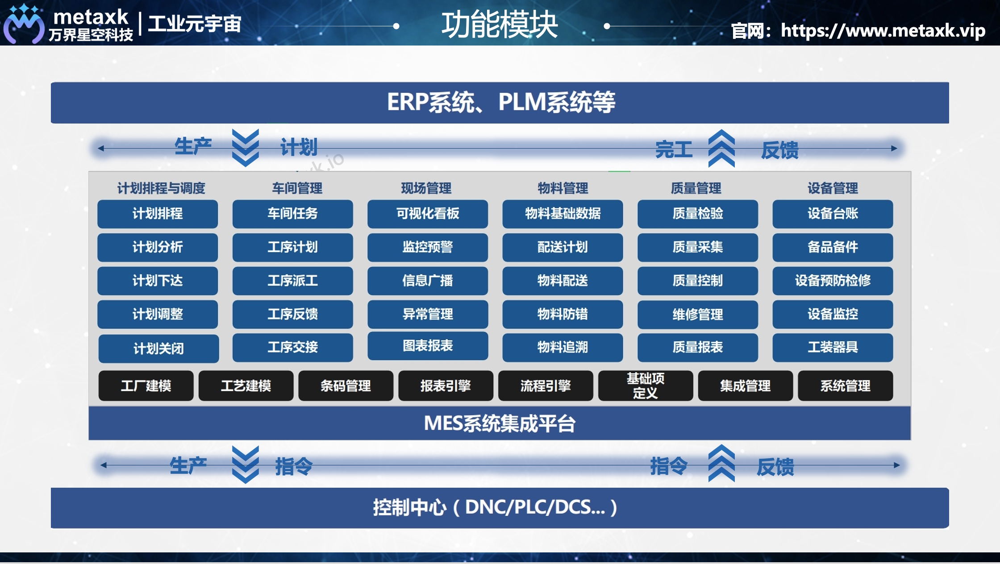

## MES排产功能图
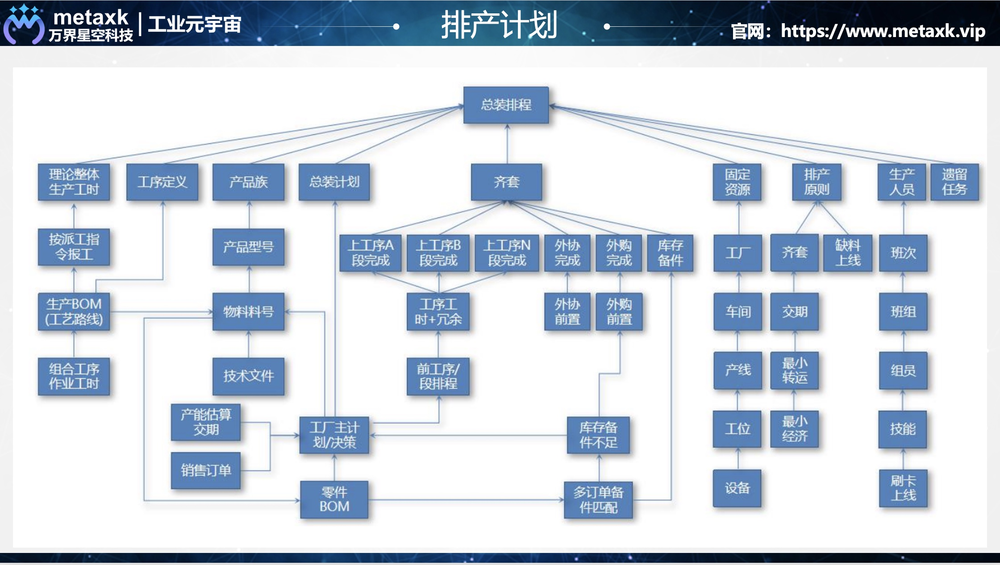

## 排班日历
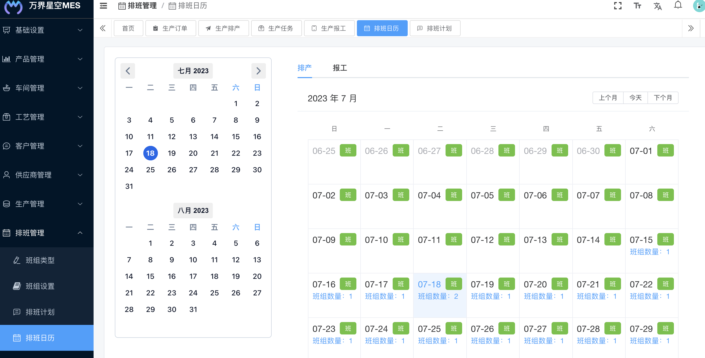

## 排班计划
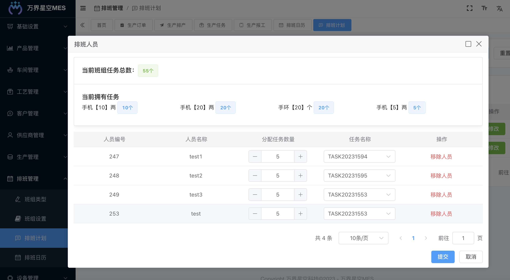

## 生产订单
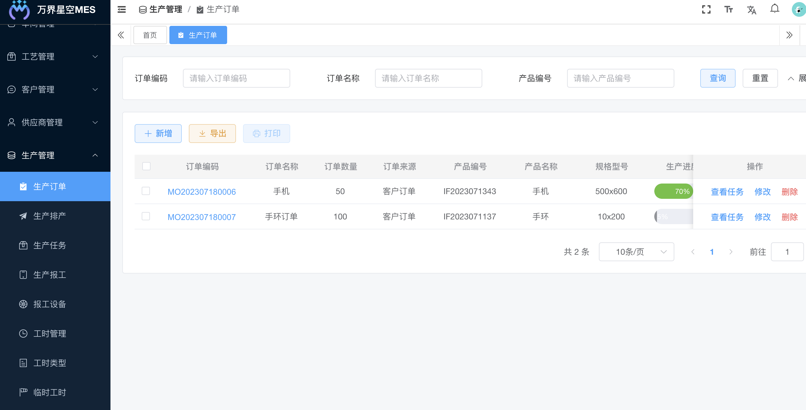

## 生产排产
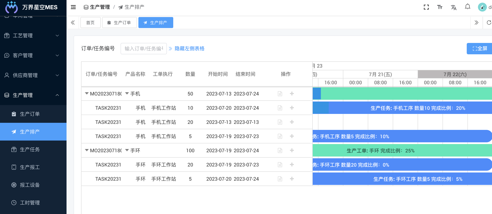

## 生产任务
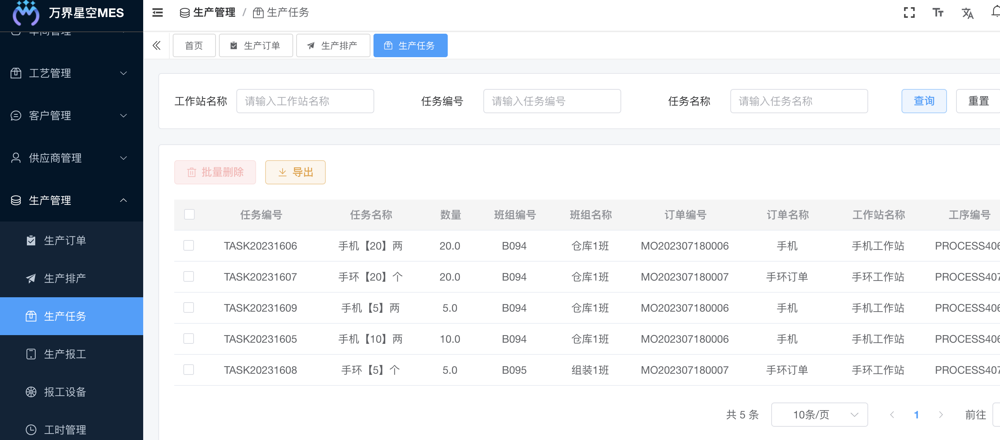

## 生产报工
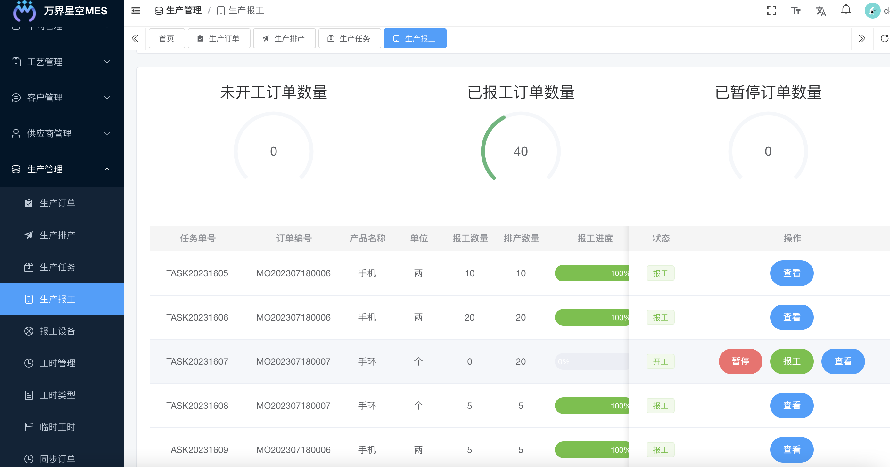

## 数据大屏1
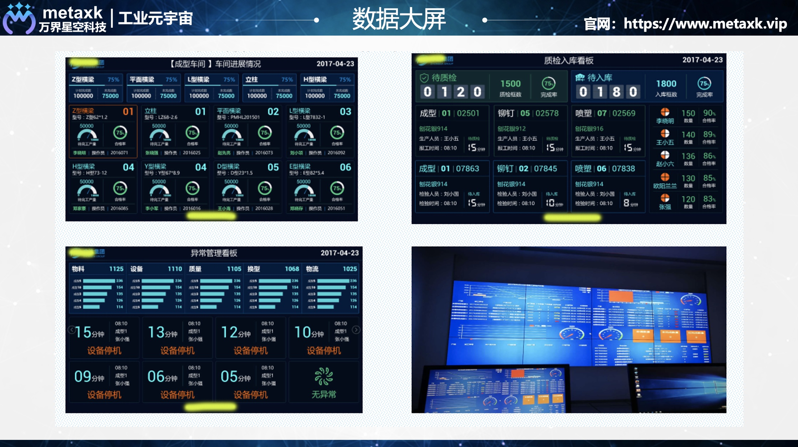

## 数据大屏2
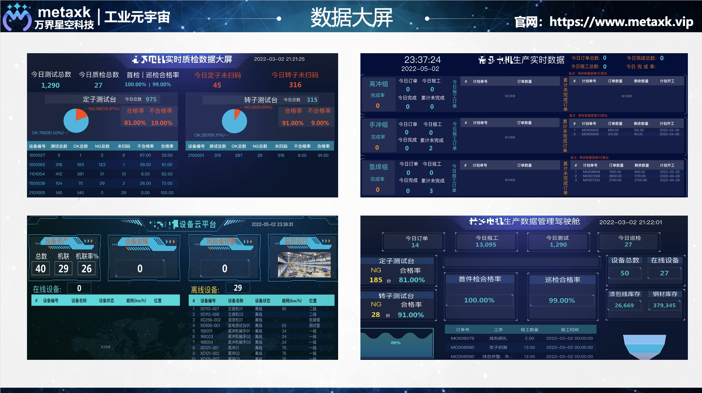

