### free mes open source mes Manufacturing Execution System
# 市面上超级好用的开源MES，支持二开
### 技术架构：Springboot2+ VUE3 + Mysql8 + Redis + Minio，也有SpringCloud版本
### 开源不易，努力坚持！记得 Star，不要白嫖~

### 目录介绍：
#### 部署和文档：基于docker的各种部署方式和使用手册
#### source-code：核心框架、前、后端源代码

### 建议安装在Ubuntu Server 22.04服务器上，需要懂技术的哦

## 开源版不再提供技术支持与问题解答，请自行下载源码编译运行

## 如需商业版请联系我们：17898898894

## MES系统流程图
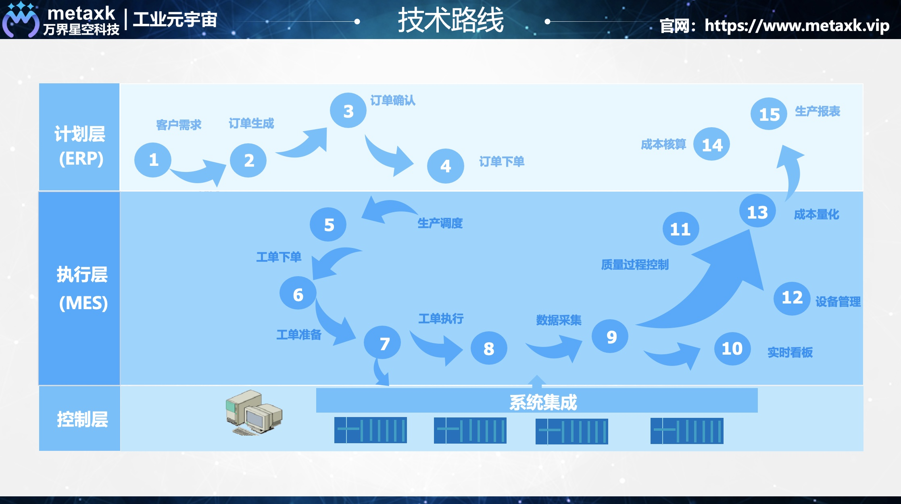

## MES功能架构图
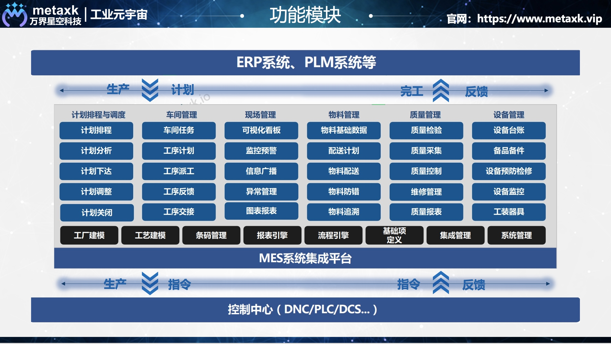

## MES排产功能图
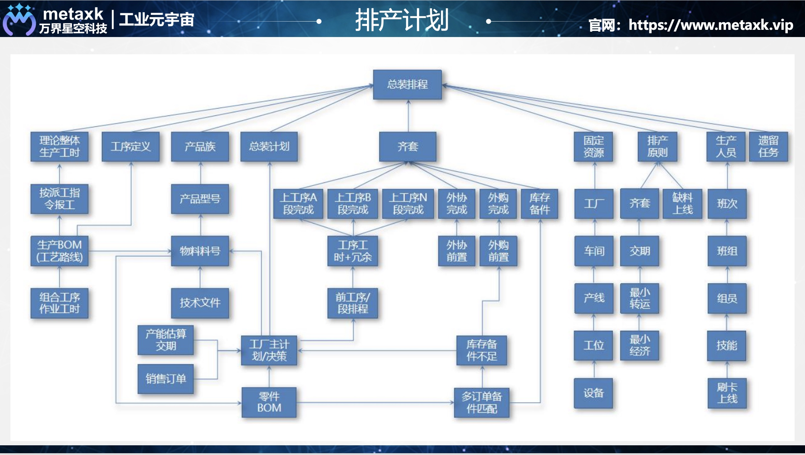

## 排班日历
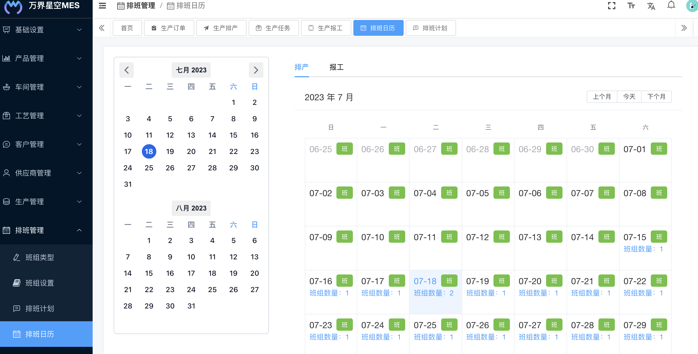

## 排班计划
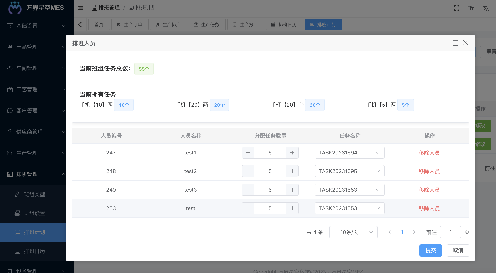

## 生产订单
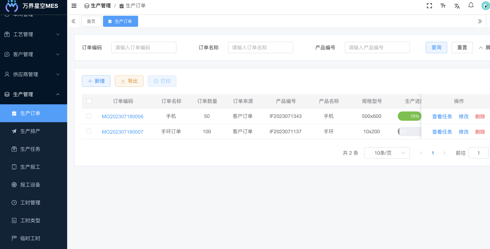

## 生产排产
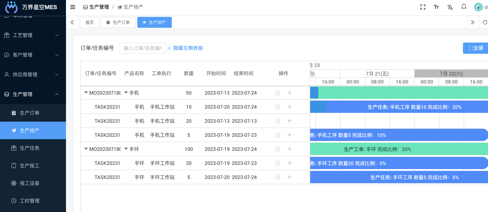

## 生产任务
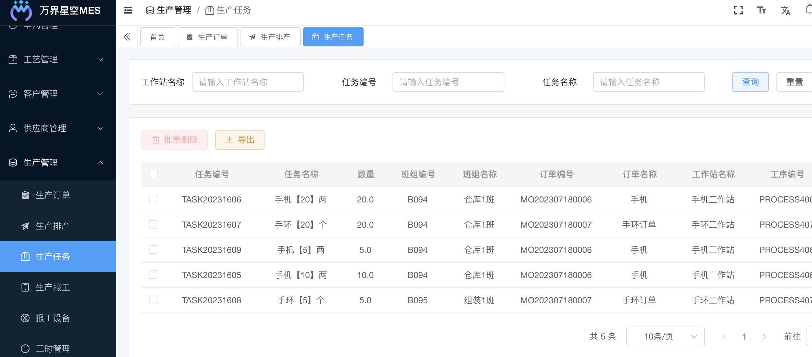

## 生产报工
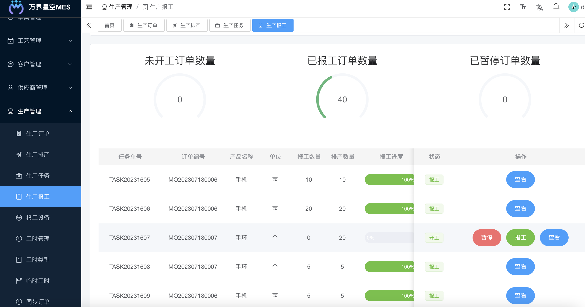

## 数据大屏1
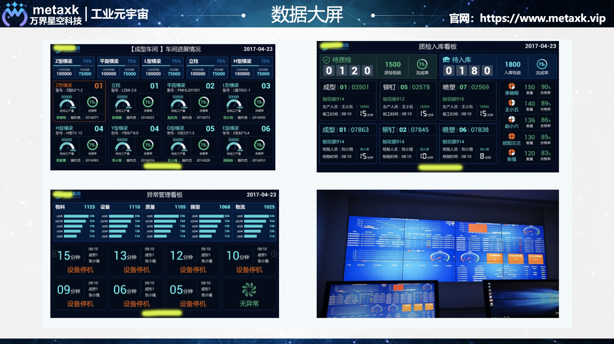

## 数据大屏2
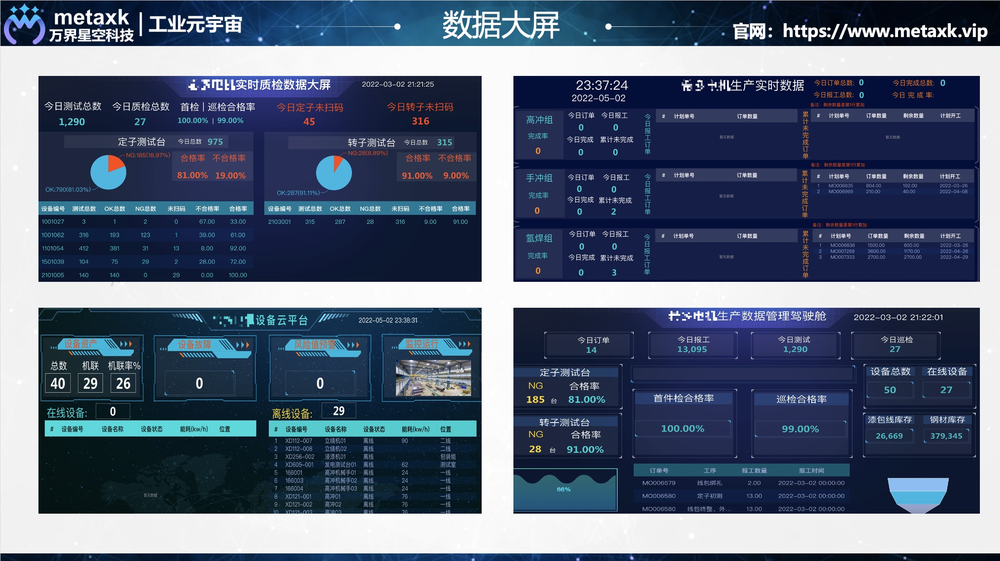
